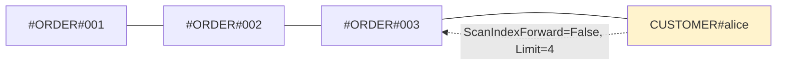
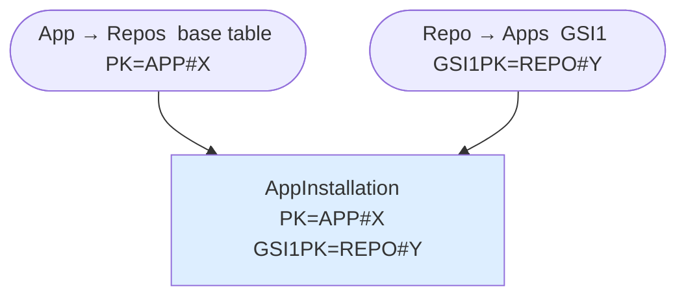

# DynamoDB Patterns & Best Practices

## Table of Contents
1. [Single-Table Design](#single-table-design)
2. [Access Pattern Gotcha: Filter Expressions](#access-pattern-gotcha-filter-expressions)
3. [Multi-Attribute Composite Keys](#multi-attribute-composite-keys)
4. [# Prefix Trick: Controlling Parent Position in Sort Order](#-prefix-trick-controlling-parent-position-in-sort-order)
5. [Numeric Difference Trick: Reverse-Order Integers on Forward Scans](#numeric-difference-trick-reverse-order-integers-on-forward-scans)
6. [Sparse Indexes](#sparse-indexes)
7. [Reference Counts](#reference-counts)
8. [TTL Guard on Reads](#ttl-guard-on-reads)
9. [Many-to-Many: Adjacency List](#many-to-many-adjacency-list)
10. [Multi-Attribute Uniqueness](#multi-attribute-uniqueness)
11. [Timestamp-Sharded Partitions (Hot Partition Prevention)](#timestamp-sharded-partitions-hot-partition-prevention)
12. [Shared Namespace (Two Entity Types, Same Key Space)](#shared-namespace-two-entity-types-same-key-space)
13. [Denormalization Decision Threshold](#denormalization-decision-threshold)
14. [Cost Optimization](#cost-optimization)
15. [Terraform Examples](#terraform-examples)

---

## Single-Table Design

### Item Collection Pattern
Group related items by partition key:

```
PK              | SK                  | Data
----------------|---------------------|------------------
ORG#acme        | METADATA            | {name, plan...}
ORG#acme        | USER#user1          | {name, email...}
ORG#acme        | USER#user2          | {name, email...}
```

Single Query retrieves org + all users:
```python
response = table.query(
    KeyConditionExpression=Key('PK').eq('ORG#acme')
)
```

---

## Access Pattern Gotcha: Filter Expressions
**Filter expressions do NOT reduce read costs!**

```python
# BAD: Scans entire partition, then filters
response = table.query(
    KeyConditionExpression=Key('PK').eq('ORG#acme'),
    FilterExpression=Attr('status').eq('active')
)
# Reads ALL items, filters after, costs same RCUs

# GOOD: Design key to support the access pattern
# SK = STATUS#active#USER#123
response = table.query(
    KeyConditionExpression=Key('PK').eq('ORG#acme') & Key('SK').begins_with('STATUS#active')
)
```

---

## Multi-Attribute Composite Keys

> AWS GA: Nov 2025 · Requires Terraform AWS Provider **v6.29.0+** ([PR #45357](https://github.com/hashicorp/terraform-provider-aws/pull/45357)) · verified 2026-02-19

GSI partition and sort keys can now be composed from **up to 4 attributes each** (8 total per GSI). DynamoDB handles hashing and sort ordering natively — no synthetic concatenated keys needed.

### Before vs After

The GSI in this example has `hash_key = ["tournamentId", "region"]` and `range_key = ["round", "bracket", "matchId"]`.

**Before** — synthetic concatenated attributes, requires string parsing and zero-padding for numeric sort:
```python
item = {
    "PK": "MATCH#match-001",
    "SK": "METADATA",
    "GSI1PK": f"TOURNAMENT#{tournament_id}#REGION#{region}",  # manually joined
    "GSI1SK": f"{round}#{bracket}#{match_id}",                # manually joined
}
```

**After** — natural domain attributes; DynamoDB handles composite hashing and sort ordering:
```python
item = {
    "PK": "MATCH#match-001",
    "SK": "METADATA",
    # GSI partition key (both required when querying)
    "tournamentId": "WINTER2024",
    "region": "NA-EAST",
    # GSI sort key (query left-to-right, stopping at any point)
    "round": "SEMIFINALS",
    "bracket": "UPPER",
    "matchId": "match-001",
}
```

### Query Rules

**Partition key** — every attribute required, equality only. Omitting any one attribute is invalid:
```python
# Valid — both PK attributes present
table.query(
    IndexName="TournamentRegionIndex",
    KeyConditionExpression="tournamentId = :t AND #region = :r",
    ExpressionAttributeNames={"#region": "region"},
    ExpressionAttributeValues={":t": "WINTER2024", ":r": "NA-EAST"},
)

# Invalid — missing region; partial PK is not allowed
table.query(
    IndexName="TournamentRegionIndex",
    KeyConditionExpression="tournamentId = :t",
)
```

**Sort key** — left-to-right, no gaps. You can stop at any SK attribute, but cannot skip one:
```python
# Valid — first SK attribute only
KeyConditionExpression="tournamentId = :t AND #region = :r AND round = :round"

# Valid — first two SK attributes
KeyConditionExpression="tournamentId = :t AND #region = :r AND round = :round AND bracket = :bracket"

# Invalid — skips round, jumps straight to bracket
KeyConditionExpression="tournamentId = :t AND #region = :r AND bracket = :bracket"
```

**Inequality** — allowed only on the last SK attribute in the expression. No further conditions after it:
```python
# Valid — inequality on the first (and only) SK attribute used
KeyConditionExpression="tournamentId = :t AND #region = :r AND round >= :start_round"

# Valid — equality on round, then inequality on bracket (the last SK attr queried)
KeyConditionExpression="tournamentId = :t AND #region = :r AND round = :round AND bracket BETWEEN :a AND :b"

# Invalid — bracket condition follows an inequality on round
KeyConditionExpression="tournamentId = :t AND #region = :r AND round > :round AND bracket = :bracket"
```

### Data Types

Each attribute retains its native type in the composite key:

| Type | Sort Behavior | Gotcha |
|------|--------------|--------|
| `S` (String) | Lexicographic | `"5"` sorts after `"1000"` — zero-pad if needed |
| `N` (Number) | Numeric | `5` < `50` < `500` < `1000` — natural order |
| `B` (Binary) | Byte-order | Raw binary comparison |

### When to Use

| Use Multi-Attribute Keys | Keep Synthetic Keys |
|--------------------------|---------------------|
| New GSIs on existing tables (no backfill needed) | Base table PK/SK (not supported there) |
| Attributes have distinct types (Number + String) | Need `begins_with()` across entity types |
| Query patterns follow hierarchical drill-down | Single-table overloaded GSI with mixed entity types |
| Clean domain model with typed attributes | Legacy tables where migration cost > benefit |

### Terraform Example

```hcl
resource "aws_dynamodb_table" "tournaments" {
  name         = "${var.project}-${var.environment}-tournaments"
  billing_mode = "PAY_PER_REQUEST"
  hash_key     = "PK"
  range_key    = "SK"

  attribute {
    name = "PK"
    type = "S"
  }

  attribute {
    name = "SK"
    type = "S"
  }

  attribute {
    name = "tournamentId"
    type = "S"
  }

  attribute {
    name = "region"
    type = "S"
  }

  attribute {
    name = "round"
    type = "S"
  }

  attribute {
    name = "bracket"
    type = "S"
  }

  attribute {
    name = "matchId"
    type = "S"
  }

  global_secondary_index {
    name            = "TournamentRegionIndex"
    hash_key        = ["tournamentId", "region"]
    range_key       = ["round", "bracket", "matchId"]
    projection_type = "ALL"
  }

  point_in_time_recovery {
    enabled = true
  }

  server_side_encryption {
    enabled = true
  }

  tags = var.tags
}
```

### Common Patterns

**Time-series IoT** — query at any time granularity:
```hcl
global_secondary_index {
  name            = "DeviceTimeIndex"
  hash_key        = ["deviceId", "locationId"]
  range_key       = ["year", "month", "day", "timestamp"]
  projection_type = "ALL"
}
```

**SaaS multi-tenancy** — tenant-scoped resource queries:
```hcl
global_secondary_index {
  name            = "TenantResourceIndex"
  hash_key        = ["tenantId", "customerId"]
  range_key       = ["resourceType", "resourceId"]
  projection_type = "ALL"
}
```

**E-commerce orders** — seller analytics by region and date:
```hcl
global_secondary_index {
  name            = "SellerOrderIndex"
  hash_key        = ["sellerId", "region"]
  range_key       = ["orderDate", "category", "orderId"]
  projection_type = "ALL"
}
```

### Anti-Patterns

```
❌ Querying later sort-key attributes while skipping earlier ones (sort keys must be used as a left-to-right prefix, e.g., round -> bracket -> matchId)
❌ Using inequality on partition key attributes
❌ Adding conditions after an inequality operator
❌ Querying sort key attributes out of definition order
❌ Forgetting ExpressionAttributeNames for reserved words (region, status, etc.)
❌ Using multi-attribute keys when you need begins_with() across entity types
```

---

## # Prefix Trick: Controlling Parent Position in Sort Order

`#` (ASCII 35) sorts before all letters and digits. Prefix child sort keys with `#` to position them *before* the parent in ascending sort — enabling "fetch parent + most recent children" in a single reverse scan.



```python
# ScanIndexForward=False, Limit=11 → Customer + 10 most recent Orders in one Query
table.query(
    KeyConditionExpression=Key("PK").eq("CUSTOMER#alice"),
    ScanIndexForward=False,
    Limit=11,
)
```

**Two one-to-many in one item collection**: give one child type a `#` prefix and leave the other without. The parent sits between them — reverse scan fetches parent + `#`-prefixed children; forward scan from the parent SK fetches the other set.

---

## Numeric Difference Trick: Reverse-Order Integers on Forward Scans

To query sequential integers (issue numbers, PR numbers) in descending order without `ScanIndexForward=False`, store `MAX_VALUE - actualValue` in the sort key. Forward scan then returns items in descending integer order.

```python
MAX_VALUE = 99_999_999  # 8-digit fixed width

# issue #1   → ISSUE#OPEN#99999998  (sorts last)
# issue #15  → ISSUE#OPEN#99999984
# issue #100 → ISSUE#OPEN#99999900  (sorts first → returned first on forward scan)
sort_key = f"ISSUE#OPEN#{MAX_VALUE - issue_number:08d}"
```

Use when: descending integer order is needed AND `ScanIndexForward=False` is unavailable (e.g., because a `begins_with` prefix or composite SK comparison is required on the same index).

---

## Sparse Indexes

Items without a GSI attribute are **excluded from the index automatically**. Use this to project only a subset of items without a filter expression.

### Variant 1 — Entity-type filter (find all items of one type)

Add the GSI attribute only when writing items of the target entity type.

```python
# Only User items get UserIndex — Orgs never appear in that GSI
item = {
    "PK": "ACCOUNT#alice",
    "Type": "User",
    "UserIndex": "USER#alice",  # absent on Org items
}
```

### Variant 2 — Conditional filter (subset within one entity type)

Add the GSI attribute when an item enters the target state; **remove it** when it exits.

```python
# Mark message as unread: set GSI attributes → item enters sparse index
update_expr = "SET GSI1PK = :pk, GSI1SK = :sk"

# Mark message as read: remove GSI attributes → item exits sparse index
update_expr = "REMOVE GSI1PK, GSI1SK"
```

---

## Reference Counts

Store a running count on the parent item — never count children at read time. `TransactWriteItems` atomically creates the child and increments the counter. The `attribute_not_exists` condition ensures idempotency — the counter only moves for genuinely new relationships.

```python
dynamodb.transact_write_items(TransactItems=[
    {
        "Put": {
            "TableName": "AppTable",
            "Item": {"PK": {"S": f"STAR#{repo}#{username}"}, "SK": {"S": "STAR"}},
            "ConditionExpression": "attribute_not_exists(PK)",
        }
    },
    {
        "Update": {
            "TableName": "AppTable",
            "Key": {"PK": {"S": f"REPO#{repo}"}, "SK": {"S": f"REPO#{repo}"}},
            "UpdateExpression": "SET StarCount = StarCount + :one",
            "ExpressionAttributeValues": {":one": {"N": "1"}},
        }
    },
])
```

To decrement, reverse: `DeleteItem` with `attribute_exists(PK)` condition + `StarCount - :one`.

---

## TTL Guard on Reads

DynamoDB TTL deletes expired items **within 48 hours** — not instantly. Guard reads with a `FilterExpression` to reject recently-expired items:

```python
import time

response = table.query(
    KeyConditionExpression=Key("PK").eq(f"SESSION#{token}"),
    FilterExpression=Attr("TTL").gt(int(time.time())),
)
```

Store both timestamps on the item:

| Attribute   | Format                   | Purpose                        |
|-------------|--------------------------|--------------------------------|
| `TTL`       | `1705916200` (epoch int) | DynamoDB auto-deletion trigger |
| `ExpiresAt` | `2024-01-22T10:30:00Z`   | Human-readable for app/debug   |

---

## Many-to-Many: Adjacency List

Create a **link item** that belongs to both parent item collections. The traversal direction you query most frequently lives in the base table; a GSI projects the link into the other parent's collection.



The link item's `PK` determines the primary traversal (base table). Its GSI attributes enable the reverse. Which side goes in the base table: whichever direction you query more frequently, or where transactional consistency matters more.

---

## Multi-Attribute Uniqueness

To enforce uniqueness across multiple attributes (e.g., username **and** email), create a **uniqueness tracking item** per attribute in the same `TransactWriteItems`. The tracking item holds no data — it exists solely to occupy the key space.

```python
dynamodb.transact_write_items(TransactItems=[
    {
        "Put": {
            "Item": {"PK": {"S": f"USER#{username}"}, "SK": {"S": f"USER#{username}"}, ...},
            "ConditionExpression": "attribute_not_exists(PK)",
        }
    },
    {
        "Put": {
            "Item": {"PK": {"S": f"USEREMAIL#{email}"}, "SK": {"S": f"USEREMAIL#{email}"}},
            "ConditionExpression": "attribute_not_exists(PK)",  # no user data here
        }
    },
])
```

If either condition fails, the entire transaction rolls back. On deletion, remove both items.

---

## Timestamp-Sharded Partitions (Hot Partition Prevention)

When all writes for a time-series entity funnel into one partition, shard by truncated timestamp so each day is a separate partition:

```python
from datetime import date

gsi_pk = f"DEALS#{date.today().isoformat()}"   # "DEALS#2024-01-22"
```

To fetch "last N items overall", query 2–3 date partitions in parallel and merge in application code.

**Read-sharding cache**: for read-heavy hot data (e.g., front-page cache), write N identical copies and read from a random shard:

```python
import random

shard = random.randint(1, N)
table.get_item(Key={"PK": f"DEALSCACHE#{shard}", "SK": f"DEALSCACHE#{shard}"})
```

---

## Shared Namespace (Two Entity Types, Same Key Space)

When two entity types must share a globally unique namespace (e.g., GitHub usernames and org names cannot collide), give them the same PK prefix. A `Type` attribute distinguishes them at read time; `attribute_not_exists(PK)` enforces uniqueness at write time.

```
PK                  | SK                  | Type
--------------------|---------------------|-------------
ACCOUNT#alice       | ACCOUNT#alice       | User
ACCOUNT#acme-corp   | ACCOUNT#acme-corp   | Organization
```

Attempting to create `ACCOUNT#alice` as an Org fails the condition — same namespace, same enforcement.

---

## Denormalization Decision Threshold

Store a one-to-many relationship as a **complex attribute (map/list) on the parent** only when both are true:

1. No direct access pattern for the child entity outside the parent context
2. The child data is bounded (a known maximum, e.g., ≤ 20 addresses)

If either is "yes", co-locate child items in the same partition using the primary key + Query approach instead.

---

## Cost Optimization

### Billing Modes

| Mode | Cost | When to Use |
|------|------|-------------|
| On-demand | ~3.5× provisioned (fully utilized) | Unpredictable or spiky traffic |
| Provisioned | Pay per reserved unit, throttles at limit | Predictable load with ≥28.8% average utilization |
| Reserved capacity | Discounted provisioned | Stable, long-running workloads |

### Storage Classes

| Class | Cost | Use When |
|-------|------|----------|
| Standard | ~$0.25/GB-month | Frequently accessed data |
| Standard-IA | ~$0.10/GB-month | Storage dominates cost (storage > 50% of throughput spend) |

> AWS's documented threshold: switch to Standard-IA when storage cost exceeds 50% of your throughput (reads + writes) cost. Standard-IA read/write rates are ~25% higher than Standard ($0.155 vs $0.125 per million reads; $0.780 vs $0.625 per million writes). Enable TTL to avoid paying for stale data.

---

### Cost Multipliers (the hidden costs)

**Item size** — rounds up per KB per operation:
```
Read  20KB item  →  5 RCUs  (ceil(20/4))
Write 10KB item  →  10 WCUs (ceil(10/1))
Write same item to a GSI → another 10 WCUs
```

**Secondary indexes** — every write to the base table propagates to each GSI:
```
1 write to table with 3 GSIs = 4× write capacity consumed
```

**Transactions** — carry a 2× cost premium vs standard reads/writes.

**Global Tables** — each write is replicated to every region; storage is also replicated. Only deploy when cross-region active-active is genuinely required.

**Strongly consistent reads** — 2× the cost of eventually consistent. Avoid unless your access pattern strictly requires them.

---

### Reducing Item Size

- Remove attributes that are never read
- Shorten attribute names — DynamoDB bills the name bytes on every read

### Secondary Index Hygiene

- Delete unused GSIs immediately — every write still propagates to them
- Use `KEYS_ONLY` or `INCLUDE` projections instead of `ALL` where possible; projected item size drives both write and read costs on the index

### Vertical Sharding

Split frequently-updated fields from static data:
```
# Instead of updating 10KB item for view count:
PK           | SK           | data (10KB)
USER#123     | PROFILE      | {name, bio, avatar...}

# Split into:
PK           | SK           | data
USER#123     | PROFILE      | {name, bio...} (9.5KB)
USER#123     | STATS        | {views: 1000} (0.1KB)
```

Writing 0.1KB instead of 10KB for stat updates cuts write cost 100×.

---

## Terraform Examples

### DynamoDB Streams with Lambda

`stream_view_type` **cannot be changed after creation** — deleting and recreating the stream risks data loss. Default to `NEW_AND_OLD_IMAGES` unless storage cost is a specific concern. See `event-driven.md` for consumer limits, error handling, and processing patterns.

```hcl
resource "aws_dynamodb_table" "with_streams" {
  # ... table config

  stream_enabled   = true
  stream_view_type = "NEW_AND_OLD_IMAGES"  # Immutable post-creation — choose deliberately
}

resource "aws_lambda_event_source_mapping" "dynamodb" {
  event_source_arn  = aws_dynamodb_table.with_streams.stream_arn
  function_name     = aws_lambda_function.stream_processor.arn
  starting_position = "LATEST"
  batch_size        = 100

  filter_criteria {
    filter {
      pattern = jsonencode({
        eventName = ["INSERT", "MODIFY"]
      })
    }
  }
}
```
